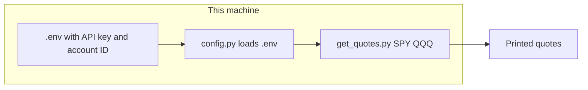

# Public.com data on this machine (minimal, no OpenClaw)

## Goal

Get Public.com market data (SPY, QQQ, etc.) on **this machine** with **minimal code**. No OpenClaw; run scripts from the repo with credentials from a local `.env`.

---

## Current state

- **Repo**: Python, [requirements.txt](requirements.txt) has `publicdotcom-py`. Scripts in `scripts/` for quotes, option chain, accounts, etc.
- **Config**: [scripts/config.py](scripts/config.py) reads from `~/.openclaw/workspace/.secrets/` first, then env. We add **.env** support so you never need OpenClaw.
- **Existing**: [scripts/get_quotes.py](scripts/get_quotes.py) and [scripts/get_option_chain.py](scripts/get_option_chain.py) already do the API calls; they just need credentials from .env.

---

## Minimal first step: get data and print it

### 1. Config without OpenClaw

- **Add .env support** in [scripts/config.py](scripts/config.py): at import, call `load_dotenv()` (from `python-dotenv`) so `PUBLIC_COM_SECRET` and `PUBLIC_COM_ACCOUNT_ID` are loaded from a `.env` file in repo root when you run any script.
- **Credential order**: env vars only (after .env is loaded). Remove or skip OpenClaw file paths so config does not depend on OpenClaw.
- Add `python-dotenv` to [requirements.txt](requirements.txt).

### 2. Local setup (your machine)

- Get API key: https://public.com/settings/v2/api
- Get account ID (one time): run `python3 scripts/get_accounts.py` with only `PUBLIC_COM_SECRET` in .env; if the script returns account IDs, put one in .env as `PUBLIC_COM_ACCOUNT_ID`. (If get_accounts requires account_id, we may need to allow optional account_id for that script.)
- Create **`.env`** in repo root (ensure it is in .gitignore):
  - `PUBLIC_COM_SECRET=your_secret`
  - `PUBLIC_COM_ACCOUNT_ID=your_account_id`
- Add **`.env.example`** with empty placeholders.

### 3. Get data and print

From repo root:

```bash
pip install -r requirements.txt
python3 scripts/get_quotes.py SPY QQQ
```

You should see last, bid, ask, volume, OHLC printed. That is "get data here on this machine" with minimal coding.

---

## Flow (minimal)



---

## Files to add/change (minimal)

| Action | File |
|--------|------|
| Change | [scripts/config.py](scripts/config.py) — load `.env` via python-dotenv; read `PUBLIC_COM_SECRET` and `PUBLIC_COM_ACCOUNT_ID` from env only (no OpenClaw paths). |
| Change | [requirements.txt](requirements.txt) — add `python-dotenv`. |
| Add | `.env.example` — `PUBLIC_COM_SECRET=`, `PUBLIC_COM_ACCOUNT_ID=`. |
| Check | `.gitignore` — ensure `.env` is ignored. |

No new scripts for the minimal first step; existing `get_quotes.py` and `get_option_chain.py` are enough once config reads from .env.

---

## Later (after "get data" works)

- **Options chain**: Same setup; run `python3 scripts/get_option_chain.py SPY` (and `--expiration`, `--list-expirations`).
- **Realtime loop**: Optional script that polls `get_quotes` every N seconds during market hours (no OpenClaw).
- **Cool stuff**: Alerts, analytics, quote + option chain in one view — all on this machine.
